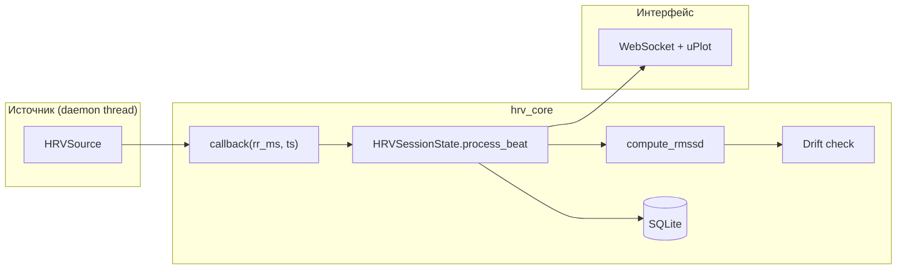

# Архитектура: HRV Awareness Monitor

Экспериментальная система мониторинга вариабельности сердечного ритма (HRV) в реальном времени: запись тегированных сессий, live-графики RMSSD, архив и сравнение практик.

> Операционные детали (веб-UI, BLE, mock, baseline): [hrv_mvp.md](hrv_mvp.md)

---

## Назначение

| Аспект | Описание |
|--------|----------|
| **Домен** | Biofeedback, wearables, экспериментальный дизайн |
| **Входной сигнал** | RR-интервалы (мс между ударами сердца) с Polar H10 или симулятора |
| **Ключевая метрика** | **RMSSD** — корень из среднего квадрата разностей соседних RR (окно 60 с) |
| **Real-time** | Графики RR и RMSSD, детекция **drift** (падение RMSSD относительно baseline) |
| **Накопление** | Тегированные сессии в SQLite, персональный baseline по часу суток, архив и прогресс |

**Важно:** drift и RMSSD — не диагноз и не «оценка осознанности». Это инструмент для сопоставления объективных кривых с субъективными метками в контролируемых экспериментах.

---

## Архитектурные слои

```
┌─────────────────────────────────────────────────────────────┐
│  UI                                                         │
│  hrv_web/ (FastAPI + SPA, uPlot, Web Audio)                 │
└────────────────────────────┬────────────────────────────────┘
                             │
┌────────────────────────────▼────────────────────────────────┐
│  hrv_core — ядро                                            │
│  pipeline (RMSSD, drift)  │  db │  summary │  sources       │
└────────────────────────────┬────────────────────────────────┘
                             │ callback(rr_ms, ts)
┌────────────────────────────▼────────────────────────────────┐
│  Источники данных (HRVSource)                               │
│  Mock  │  Polar BLE                                              │
└─────────────────────────────────────────────────────────────┘
```

**Принцип:** одно ядро (`hrv_core`), веб-интерфейс для записи и визуализации, локальное хранилище без облачных сервисов.

---

## Поток данных



### Обработка одного удара

1. **Источник** (`hrv_core/sources.py`) в отдельном потоке вызывает `callback(rr_ms, ts)`.
2. **`HRVSessionState.process_beat()`** (`hrv_core/pipeline.py`): скользящий буфер RR (60 с), RMSSD, drift; возвращает `BeatSample(ts, rr_ms, rmssd, drift_just_fired)`.
3. **Веб-слой** сохраняет точку в `hrv_points`, отправляет метрики по WebSocket, обновляет графики (uPlot).
4. **При завершении сессии** — summary, обновление персонального baseline по часу.

---

## Компоненты

### `hrv_core/` — ядро

| Модуль | Роль |
|--------|------|
| `constants.py` | Пороги, таймауты, пути (`DB_PATH`, `DRIFT_THRESHOLD=0.80`, окно RMSSD 60 с) |
| `sources.py` | Абстракция `HRVSource`, реализации mock/BLE, фабрика `build_source()` |
| `pipeline.py` | `compute_rmssd()`, `HRVSessionState`, детекция drift (опц. `notify-send`) |
| `db.py` | Схема SQLite, миграции, baseline по часу 0–23, удаление сессий |
| `session_types.py` | Системные типы сессий (seed в БД при первом запуске): slug, label, mock-профиль, phrase_prefix |
| `tags.py` | Нормализация метки `tag` при старте сессии |
| `summary.py` | Session summary (JSON API) |
| `ble_scan.py` | BLE-сканирование Polar, проверка BlueZ/bleak (подключение) |

### `hrv_web/` — веб-интерфейс

| Модуль | Роль |
|--------|------|
| `server.py` | FastAPI: REST + WebSocket, раздача статики |
| `session_manager.py` | `SessionManager` — одна активная сессия, очередь для WebSocket |
| `static/app.js` | SPA: форма, WebSocket, архив, прогресс, guided-фразы |
| `static/meditation_engine.js` | HRV-реактивные mp3-фразы (meditation → sit, relaxation → lay) |
| `static/hrv_audio_engine.js` | Web Audio: пульс, текстуры, трансовый pad |
| `static/index.html` | UI режимов «Дышащий Эмбиент» / «Трансовый Порог» |

### Точки входа

| Команда | Назначение |
|---------|------------|
| `python -m hrv_web` | Основной UI: http://127.0.0.1:8765/ |

---

## Абстракция источника данных

```python
class HRVSource(ABC):
    def start(self, callback): ...  # callback(rr_ms: float, ts: float)
    def stop(self): ...
```

| Реализация | Описание |
|------------|----------|
| `MockHRVSource` | AR(1)-симуляция; цикл focused→drift→recovering или профиль медитации (RSA) |
| `PolarH10Source` | BLE GATT 0x2A37, reconnect, watchdog по отсутствию RR |

Переключение: поле `source` в веб-форме (`mock`, `ble`).

---

## Baseline и drift

| Термин | Когда используется |
|--------|-------------------|
| **Session baseline** | ≥ 30 точек RMSSD в сессии → среднее по последним до 60 значений |
| **Persistent baseline** | < 30 точек → среднее RMSSD для часа старта из таблицы `baseline` |
| **Drift** | `current_rmssd < baseline × 0.80`, не чаще 1 раза в 120 с |

Persistent baseline накапливается между сессиями инкрементально (cap 500 сэмплов на час).

---

## Модель данных (SQLite)

Файл: `hrv_data.sqlite` (создаётся автоматически).

```sql
sessions        (id, tag, source, session_name, participant, started, ended,
                 drift_events, opt_guided_phrases, opt_audio_biofeedback)
hrv_points      (id, session_id, ts, rr_ms, rmssd)
baseline        (hour, rmssd_mean, n_samples, updated_at)   -- hour 0–23
session_types   (slug, label, phrase_prefix, mock_profile, chart_profile, is_custom)
meditation_phrase_log (session_id, phrase_file, played_at, rn_before, rmssd_before, …)
```

### Тегирование

Два независимых механизма — подробнее в [hrv_mvp.md § Тегирование](hrv_mvp.md#тегирование-сессий):

| | Поле БД | Как задать | Фильтр в UI |
|---|---------|------------|-------------|
| **Тип активности** | `sessions.tag` (slug) | Список «Тип активности» до старта | «Тип активности» |
| **Теги заметок** | `#…` внутри `sessions.session_name` | Поле «Заметка» / модал после «Стоп» | «Тег заметки» |

**Типы активности (slug в `sessions.tag`):** системные — `relaxation`, `meditation`, `test`, `yoga`, `sleep`, `work`, `mental_training`; плюс пользовательские в `session_types` (`is_custom=1`).

**Теги заметок:** формат `#слово` в тексте заметки. Парсинг — [`hrv_core/note_tags.py`](hrv_core/note_tags.py). API: `GET /api/note-tags`; фильтр — один или несколько `note_tag=…` (OR: сессия содержит любой из тегов).

- **Seed:** при старте `init_db()` таблица `session_types` синхронизируется с [`hrv_core/session_types.py`](hrv_core/session_types.py); устаревшие встроенные slug-и удаляются.
- **Runtime (веб):** списки в форме и фильтрах — `GET /api/session-types`; новый тип — «Новая активность…» → `POST /api/session-types`.

---

## Веб-API (кратко)

| Endpoint | Метод | Описание |
|----------|-------|----------|
| `/` | GET | SPA |
| `/api/health` | GET | Статус сервера и путь к БД |
| `/api/session-types` | GET | Список типов активности (системные + пользовательские) |
| `/api/session-types` | POST | Создать пользовательский тип (`slug`, `label`) |
| `/api/session-types/{slug}` | DELETE | Удалить пользовательский тип (системные — 403) |
| `/api/note-tags` | GET | Уникальные теги из заметок (`#утро` → `утро`) |
| `/api/sessions` | POST/GET | Старт / список сессий (фильтры: participant, tag, note_tag, период) |
| `/api/sessions/{id}` | PATCH | Заметки после завершения (`session_name`) |
| `/api/sessions/{id}/stop` | POST | Остановка + summary |
| `/api/sessions/{id}/stream` | WebSocket | Live: `beat`, `meta`, `ended` |
| `/api/sessions/{id}` | GET/DELETE | Summary завершённой сессии / удаление |
| `/api/sessions/{id}/points` | GET | Точки (с downsampling) |
| `/api/progress` | GET | Наложение RMSSD-кривых завершённых сессий |
| `/api/history` | DELETE | Очистка всей истории |
| `/api/meditation/phrase-manifest` | GET | Список mp3-фраз в `static/phrases/` |
| `/api/meditation/phrase-log` | POST/PATCH | Лог воспроизведения guided-фраз |
| `/api/meditation/phrase-stats` | GET | Статистика фраз по `session_id` |

Одновременно допускается **только одна активная сессия** (409 Conflict при повторном старте).

---

## Веб-аудио: где генерируется звук

Генеративный звук синтезируется **только в браузере** (Web Audio API). Сервер аудио не передаёт: по WebSocket приходят метрики (`beat`), клиент воспроизводит звук локально.

**Файлы:** [`hrv_web/static/hrv_audio_engine.js`](hrv_web/static/hrv_audio_engine.js) (синтез), [`hrv_web/static/app.js`](hrv_web/static/app.js) (маршрутизация).

### Цепочка вызова

```
WebSocket { type: "beat" }
  → app.js: onWsMessage()
  → processAudioFrame(msg, i)
  → audioEngine.processFrame(frame)   // фон + трансовый pad
  → audioEngine.triggerBeat(rr_ms)    // щелчок на каждый удар
```

Кадр `beat` содержит: `r` (RR), `m` (RMSSD), `sr` (smoothed_rr), `rn` (rmssd_normalized), `bl` (session baseline), `drift`.

### 1. Звук на каждый пульс

| | |
|---|---|
| **Метод** | `HrvAudioEngine.triggerBeat(rrMs)` |
| **Когда** | На **каждый** RR из WebSocket, в **обоих** режимах |
| **Как** | Два одноразовых осциллятора (sine + triangle), AD-огибающая ~0.22 с |
| **Частота** | `_rrToPitch()` — пентатоника из `config.beat.pentatonic` по RR |
| **Выход** | `heartBeatGain` → `masterGain` → динамики |

Параметры: `config.beat.duration`, `gainPeak`, `pentatonic`.

### 2. Монотонный (фоновый) звук

| | |
|---|---|
| **Запуск** | `HrvAudioEngine.start()` → `_createTexture()` |
| **Текстуры** | `space_pad` (4 sawtooth), `sea_wave` (loop-шум + LFO), `tibetan_bowl` (5 sine + LFO) |
| **Когда играет** | Постоянно после «▶ Запустить звук», пока сессия активна |

**Режим «Дышащий Эмбиент»** (`smooth_rr`): громкость фона не меняется, меняется **cutoff lowpass** по `smoothed_rr` — `_setTextureCutoff()` в `processFrame()`.

**Режим «Трансовый Порог»** (`rmssd_trigger`): та же текстура играет тихо (`rmssdTrigger.textureGain`) через `rmssdMixGain`.

### 3. Звук на резкую смену состояния (только «Трансовый Порог»)

| | |
|---|---|
| **Режим** | `rmssd_trigger` |
| **Осцилляторы** | 4 sine на `padFreqs` — создаются в `start()`, крутятся всегда |
| **Триггер** | `processFrame()` при изменении `rmssd_normalized` |
| **Громкость** | `_rmssdToPadGain(rn)` → `padGain.setTargetAtTime(gain, t0, padSmoothSec)` |

Пороги (`config.rmssdTrigger`):

| Параметр | Значение | Смысл |
|----------|----------|--------|
| `threshold` | 1.0 | ниже — pad выключен |
| `rampStart` | 2.5 | начало нарастания |
| `rampEnd` | 3.5 | полная громкость `padGainMax` |
| `padSmoothSec` | 0.08 | скорость нарастания/затухания pad |

«Скачок» = рост `rn` выше `rampStart`; затухание — когда `rn` падает (тот же `padSmoothSec`).

### Режимы и микшер

```
masterGain
├── heartBeatGain          ← triggerBeat (всегда)
├── smoothMixGain          ← текстура в режиме smooth_rr
└── rmssdMixGain           ← текстура (тихо) + padGain (транс)
```

Переключение режимов: радиокнопки `audio_mode` в форме → `setMode()` кроссфейдом `rampSec`.

---

## Потоки и синхронизация

| Поток | Роль |
|-------|------|
| Источник (mock / asyncio BLE) | Producer: вызывает callback на каждый RR |
| Main / FastAPI | Consumer: WebSocket, SQLite, uPlot в браузере |
| `notify-send` | Опционально в `HRVSessionState` (в веб-сессии отключён: `desktop_notify=False`) |

Обмен данными: `collections.deque` (thread-safe), `queue.Queue` для WebSocket. SQLite: `check_same_thread=False`.

---

## Стек

Python 3.12 · numpy · scipy · bleak (BLE) · FastAPI · uvicorn · SQLite · uPlot (CDN)

---

## Паттерны проектирования

- **Strategy + Factory** — `HRVSource` + `build_source(kind)`.
- **Shared core, web UI** — один pipeline, веб для записи и графиков.
- **Single active session** — `SessionManager`.
- **Incremental personal baseline** — per-hour RMSSD между сессиями.
- **Graceful hardware handling** — reconnect, watchdog, подсказки про «занятый» H10.

---

## Структура репозитория

```
consciousness/
├── hrv_core/           # Ядро: источники, pipeline, БД, session_types (seed), note_tags
├── tests/              # unittest (pipeline, tags, db, …)
├── hrv_web/            # FastAPI + статика (app.js, hrv_audio_engine.js, meditation_engine.js)
├── requirements.txt
├── hrv_data.sqlite     # БД (runtime)
├── ARCHITECTURE.md     # Этот документ
└── hrv_mvp.md          # Детальная спецификация MVP
```

---

## Аудио-биофидбек (веб)

Биофидбек реализован в браузере: вкладка «Биофидбек», [`hrv_audio_engine.js`](hrv_web/static/hrv_audio_engine.js) (Web Audio). Сервер передаёт только метрики RR/RMSSD по WebSocket.

