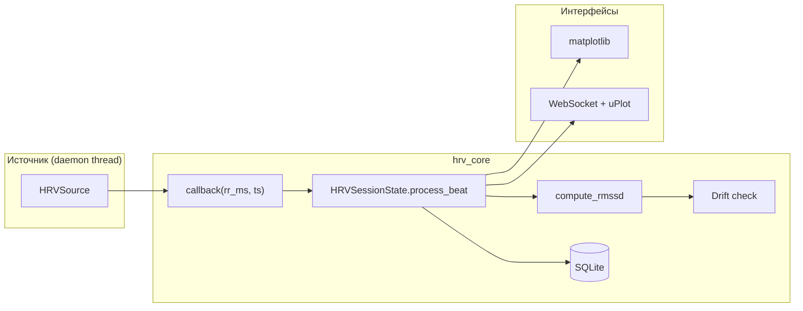

# Архитектура: HRV Awareness Monitor

Экспериментальная система мониторинга вариабельности сердечного ритма (HRV) в реальном времени. Проект проверяет гипотезу: **можно ли по одному сигналу RMSSD выделить физиологические кластеры, согласующиеся с субъективными метками активности пользователя** (медитация, фокус, отдых, скроллинг).

> Операционные детали (CLI, BLE/ANT+, mock, baseline): [hrv_mvp.md](hrv_mvp.md)

---

## Назначение

| Аспект | Описание |
|--------|----------|
| **Домен** | Biofeedback, wearables, экспериментальный дизайн |
| **Входной сигнал** | RR-интервалы (мс между ударами сердца) с Polar H10 или симулятора |
| **Ключевая метрика** | **RMSSD** — корень из среднего квадрата разностей соседних RR (окно 60 с) |
| **Real-time** | Графики RR и RMSSD, детекция **drift** (падение RMSSD относительно baseline) |
| **Накопление** | Тегированные сессии в SQLite, персональный baseline по часу суток |
| **Анализ** | Offline-кластеризация HDBSCAN по RMSSD (`cluster.py`) |

**Важно:** drift и RMSSD — не диагноз и не «оценка осознанности». Это инструмент для сопоставления объективных кривых с субъективными метками в контролируемых экспериментах.

---

## Архитектурные слои

```
┌─────────────────────────────────────────────────────────────┐
│  UI                                                         │
│  hrv_monitor.py (CLI + matplotlib)   hrv_web/ (FastAPI+SPA) │
└────────────────────────────┬────────────────────────────────┘
                             │
┌────────────────────────────▼────────────────────────────────┐
│  hrv_core — ядро                                            │
│  pipeline (RMSSD, drift)  │  db (SQLite)  │  summary         │
└────────────────────────────┬────────────────────────────────┘
                             │ callback(rr_ms, ts)
┌────────────────────────────▼────────────────────────────────┐
│  Источники данных (HRVSource)                               │
│  Mock  │  Polar BLE  │  ANT+  │  BLE→ANT fallback          │
└─────────────────────────────────────────────────────────────┘
                             │
┌────────────────────────────▼────────────────────────────────┐
│  Анализ (offline)                                           │
│  cluster.py — HDBSCAN по накопленным RMSSD                  │
└─────────────────────────────────────────────────────────────┘
```

**Принцип:** одно ядро (`hrv_core`), два независимых интерфейса (CLI и веб), локальное хранилище без облачных сервисов.

---

## Поток данных



### Обработка одного удара

1. **Источник** (`hrv_core/sources.py`) в отдельном потоке вызывает `callback(rr_ms, ts)`.
2. **`HRVSessionState.process_beat()`** (`hrv_core/pipeline.py`):
   - обновляет скользящий буфер RR (60 с) и историю для графиков;
   - считает RMSSD;
   - сравнивает с baseline и при необходимости фиксирует **drift**;
   - возвращает `BeatSample(ts, rr_ms, rmssd, drift_just_fired)`.
3. **UI-слой** сохраняет точку в `hrv_points`, обновляет графики (CLI или WebSocket).
4. **При завершении сессии** — summary, обновление персонального baseline по часу.

---

## Компоненты

### `hrv_core/` — ядро

| Модуль | Роль |
|--------|------|
| `constants.py` | Пороги, таймауты, пути (`DB_PATH`, `DRIFT_THRESHOLD=0.80`, окно RMSSD 60 с) |
| `sources.py` | Абстракция `HRVSource`, реализации mock/BLE/ANT+/fallback, фабрика `build_source()` |
| `pipeline.py` | `compute_rmssd()`, `HRVSessionState`, детекция drift, `notify-send` |
| `db.py` | Схема SQLite, миграции, baseline по часу 0–23 |
| `summary.py` | Session summary для CLI и JSON API |
| `ble_scan.py` | BLE-сканирование Polar, проверка BlueZ/bleak |
| `mock_verify.py` | Валидация mock-генератора без UI и БД |

### `hrv_web/` — веб-интерфейс

| Модуль | Роль |
|--------|------|
| `server.py` | FastAPI: REST + WebSocket, раздача статики |
| `session_manager.py` | `SessionManager` — одна активная сессия, очередь для WebSocket |
| `static/` | SPA: форма сессии, live-графики (uPlot), архив |

### Точки входа

| Команда | Назначение |
|---------|------------|
| `python -m hrv_web` | Основной UI: http://127.0.0.1:8765/ |
| `python hrv_monitor.py` | CLI с matplotlib, `--mock`, `--scan`, BLE/ANT |
| `python cluster.py` | HDBSCAN по накопленным данным |

---

## Абстракция источника данных

```python
class HRVSource(ABC):
    def start(self, callback): ...  # callback(rr_ms: float, ts: float)
    def stop(self): ...
```

| Реализация | Описание |
|------------|----------|
| `MockHRVSource` | AR(1)-симуляция; цикл focused→drift→recovering или профиль медитации (RSA) |
| `PolarH10Source` | BLE GATT 0x2A37, reconnect, watchdog по отсутствию RR |
| `AntPlusHRVSource` | ANT+ Heart Rate через openant (опционально) |
| `FallbackBleAntSource` | 30 с ожидания BLE → переключение на ANT+ |

Переключение: аргументы CLI или поле `source` в веб-форме (`mock`, `ble`, `ant`, `ble_ant_fallback`).

---

## Baseline и drift

| Термин | Когда используется |
|--------|-------------------|
| **Session baseline** | ≥ 30 точек RMSSD в сессии → среднее по последним до 60 значений |
| **Persistent baseline** | < 30 точек → среднее RMSSD для часа старта из таблицы `baseline` |
| **Drift** | `current_rmssd < baseline × 0.80`, не чаще 1 раза в 120 с |

Persistent baseline накапливается между сессиями инкрементально (cap 500 сэмплов на час).

---

## Модель данных (SQLite)

Файл: `hrv_data.sqlite` (создаётся автоматически).

```sql
sessions   (id, tag, source, session_name, participant, started, ended, drift_events)
hrv_points (id, session_id, ts, rr_ms, rmssd)
baseline   (hour, rmssd_mean, n_samples, updated_at)   -- hour 0–23
```

**Теги сессий:** `meditation`, `focus`, `rest`, `scroll`, `untagged`.

---

## Веб-API (кратко)

| Endpoint | Метод | Описание |
|----------|-------|----------|
| `/` | GET | SPA |
| `/api/sessions` | POST/GET | Старт / список сессий |
| `/api/sessions/{id}/stop` | POST | Остановка + summary |
| `/api/sessions/{id}/stream` | WebSocket | Live: `beat`, `meta`, `ended` |
| `/api/sessions/{id}/points` | GET | Точки (с downsampling) |
| `/api/scan` | GET | BLE-сканирование Polar |

Одновременно допускается **только одна активная сессия** (409 Conflict при повторном старте).

---

## Потоки и синхронизация

| Поток | Роль |
|-------|------|
| Источник (mock / asyncio BLE / ANT+) | Producer: вызывает callback на каждый RR |
| Main / FastAPI | Consumer: графики, WebSocket, SQLite |
| `notify-send` | Отдельный daemon-thread при drift |

Обмен данными: `collections.deque` (thread-safe), `queue.Queue` для WebSocket. SQLite: `check_same_thread=False`.

---

## Offline-анализ (`cluster.py`)

1. Загрузка `hrv_points` + `sessions` из SQLite.
2. По умолчанию mock-сессии **исключаются** (`--include-mock` для тестов).
3. HDBSCAN **только по RMSSD** (StandardScaler).
4. Визуализация: scatter RMSSD × час суток, boxplot по кластерам; час — для графика, не признак кластеризации.

---

## Стек

Python 3.12 · numpy · bleak (BLE) · openant (опц.) · matplotlib · FastAPI · uvicorn · SQLite · hdbscan · scikit-learn · uPlot (CDN)

---

## Паттерны проектирования

- **Strategy + Factory** — `HRVSource` + `build_source(kind)`.
- **Shared core, dual UI** — один pipeline, CLI и веб.
- **Single active session** — `SessionManager` / mutex в CLI.
- **Incremental personal baseline** — per-hour RMSSD между сессиями.
- **Graceful hardware handling** — reconnect, watchdog, подсказки про «занятый» H10.

---

## Структура репозитория

```
consciousness/
├── hrv_core/           # Ядро: источники, pipeline, БД
├── hrv_web/            # FastAPI + статика
├── hrv_monitor.py      # CLI
├── cluster.py          # Кластеризация
├── requirements.txt
├── hrv_data.sqlite     # БД (runtime)
├── ARCHITECTURE.md     # Этот документ
└── hrv_mvp.md          # Детальная спецификация MVP
```
