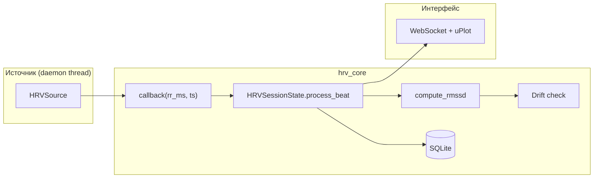

# Архитектура: HRV Awareness Monitor

Экспериментальная система мониторинга вариабельности сердечного ритма (HRV) в реальном времени: запись тегированных сессий, live-графики RMSSD, архив и сравнение практик.

> Операционные детали (веб-UI, BLE, mock, baseline): [hrv_mvp.md](hrv_mvp.md)

---

## Назначение

| Аспект | Описание |
|--------|----------|
| **Домен** | Biofeedback, wearables, экспериментальный дизайн |
| **Входной сигнал** | RR-интервалы (мс между ударами сердца) с Polar H10 или симулятора |
| **Ключевая метрика** | **RMSSD** — корень из среднего квадрата разностей соседних RR (окно 60 с) |
| **Real-time** | Графики RR и RMSSD, детекция **drift** (падение RMSSD относительно baseline) |
| **Накопление** | Тегированные сессии в SQLite, персональный baseline по часу суток, архив и прогресс |

**Важно:** drift и RMSSD — не диагноз и не «оценка осознанности». Это инструмент для сопоставления объективных кривых с субъективными метками в контролируемых экспериментах.

---

## Архитектурные слои

```
┌─────────────────────────────────────────────────────────────┐
│  UI                                                         │
│  hrv_web/ (FastAPI + SPA, uPlot, Web Audio)                 │
└────────────────────────────┬────────────────────────────────┘
                             │
┌────────────────────────────▼────────────────────────────────┐
│  hrv_core — ядро                                            │
│  pipeline (RMSSD, drift)  │  db │  summary │  sources       │
└────────────────────────────┬────────────────────────────────┘
                             │ callback(rr_ms, ts)
┌────────────────────────────▼────────────────────────────────┐
│  Источники данных (HRVSource)                               │
│  Mock  │  Polar BLE                                              │
└─────────────────────────────────────────────────────────────┘
```

**Принцип:** одно ядро (`hrv_core`), веб-интерфейс для записи и визуализации, локальное хранилище без облачных сервисов.

---

## Поток данных


```mermaid
flowchart LR
    subgraph Source["Источник (daemon thread)"]
        S[HRVSource]
    end

    subgraph Core["hrv_core"]
        CB["callback(rr_ms, ts)"]
        ST[HRVSessionState.process_beat]
        RM[compute_rmssd]
        DR[Drift check]
        DB[(SQLite)]
    end

    subgraph UI["Интерфейс"]
        WEB[WebSocket + uPlot]
    end

    S --> CB --> ST
    ST --> RM --> DR
    ST --> DB
    ST --> WEB
```

### Жизненный цикл сессии (arm с первого RR)

Отсчёт длительности, ось live-графика, guided-фразы и release-протокол стартуют **не** в момент `POST /api/sessions`, а с **первого реального RR** (arm).

1. **Старт** (`SessionManager.start`): запись в `sessions`, запуск источника, сторож `ARM_TIMEOUT_SEC` (300 с) — если RR так и не пришёл, сессия останавливается.
2. **Первый RR** → `_arm(ts)`: `first_beat_at = ts`, `UPDATE sessions SET started = ts`, WS `{type:"armed", started_at}`, старт таймера авто-стопа (`duration_minutes`), если задан.
3. **Клиент** (`app.js`): до arm — «ожидание устройства»; по `armed` / `meta.first_beat_at` / первому `beat` — `armSession()` (T0, фразы, аудио).
4. **Стоп** — summary, обновление персонального baseline по часу.

### Обработка одного удара

1. **Источник** (`hrv_core/sources.py`) в отдельном потоке вызывает `callback(rr_ms, ts)`.
2. **`SessionManager`**: при первом колбэке вызывает `_arm`, затем `RunningSession.on_beat`.
3. **`HRVSessionState.process_beat()`** (`hrv_core/pipeline.py`): скользящий буфер RR (60 с), RMSSD, drift; возвращает `BeatSample(ts, rr_ms, rmssd, drift_just_fired)` (первый удар может не дать sample, пока RMSSD = 0).
4. **Веб-слой** сохраняет точку в `hrv_points`, отправляет метрики по WebSocket, обновляет графики (uPlot).

---

## Компоненты

### `hrv_core/` — ядро

| Модуль | Роль |
|--------|------|
| `constants.py` | Пороги, таймауты, пути (`DB_PATH`, `DRIFT_THRESHOLD=0.80`, окно RMSSD 60 с) |
| `sources.py` | Абстракция `HRVSource`, реализации mock/BLE, фабрика `build_source()` |
| `pipeline.py` | `compute_rmssd()`, `HRVSessionState`, детекция drift (опц. `notify-send`) |
| `db.py` | Схема SQLite, миграции, baseline по часу 0–23, удаление сессий |
| `session_types.py` | Системные типы сессий (seed в БД при первом запуске): slug, label, mock-профиль, phrase_prefix |
| `tags.py` | Нормализация метки `tag` при старте сессии |
| `summary.py` | Session summary (JSON API) |
| `preprocessing.py` | Маска стабильной зоны, detrend для FFT, границы viewport Poincaré |
| `analysis.py` | Post-session: Poincaré, Welch PSD, SDNN/RMSSD trends, coherence |
| `ble_scan.py` | BLE-сканирование Polar, проверка BlueZ/bleak (подключение) |

### `hrv_web/` — веб-интерфейс

| Модуль | Роль |
|--------|------|
| `server.py` | FastAPI: REST + WebSocket, раздача статики |
| `session_manager.py` | `SessionManager` — одна активная сессия; arm с первого RR; очередь WS |
| `static/app.js` | SPA: форма, WebSocket, архив, прогресс; `armSession` после первого удара |
| `static/analysis_charts.js` | Отрисовка архивных графиков (RR, SDNN, Poincaré, FFT, overlay) |
| `static/meditation_engine.js` | HRV-реактивные mp3-фразы (meditation → sit, relaxation → lay) |
| `static/timed_protocol_engine.js` | Последовательный протокол «Телесное расслабление» (`release`) по `release_schedule.json` |
| `static/hrv_audio_engine.js` | Web Audio: пульс, текстуры, трансовый pad |
| `static/session_mic_recorder.js` | Запись микрофона с arm: `prepare()` на POST, `startAtArm()` — новый stream и `MediaRecorder` в arm |
| `static/session_audio_player.js` | Архивный плеер: клик по RR → seek, playhead, Play/Pause |
| `static/index.html` | UI режимов «Дышащий Эмбиент» / «Трансовый Порог» |

### Точки входа

| Команда | Назначение |
|---------|------------|
| `python -m hrv_web` | Основной UI: http://127.0.0.1:8765/ |

---

## Абстракция источника данных

```python
class HRVSource(ABC):
    def start(self, callback): ...  # callback(rr_ms: float, ts: float)
    def stop(self): ...
```

| Реализация | Описание |
|------------|----------|
| `MockHRVSource` | AR(1)-симуляция; цикл focused→drift→recovering или профиль медитации (RSA) |
| `PolarH10Source` | BLE GATT 0x2A37, reconnect, watchdog по отсутствию RR |

Переключение: поле `source` в веб-форме (`mock`, `ble`).

---

## Baseline и drift

| Термин | Когда используется |
|--------|-------------------|
| **Session baseline** | ≥ 30 точек RMSSD в сессии → среднее по последним до 60 значений |
| **Persistent baseline** | < 30 точек → среднее RMSSD для часа старта из таблицы `baseline` |
| **Drift** | `current_rmssd < baseline × 0.80`, не чаще 1 раза в 120 с |

Persistent baseline накапливается между сессиями инкрементально (cap 500 сэмплов на час).

---

## Модель данных (SQLite)

Файл: `hrv_data.sqlite` (создаётся автоматически).

```sql
sessions        (id, tag, source, session_name, participant, started, ended,
                 drift_events, opt_guided_phrases, opt_audio_biofeedback,
                 opt_mic_recording, has_audio)
hrv_points      (id, session_id, ts, rr_ms, rmssd)
baseline        (hour, rmssd_mean, n_samples, updated_at)   -- hour 0–23
session_types   (slug, label, phrase_prefix, mock_profile, chart_profile, is_custom)
meditation_phrase_log (session_id, phrase_file, played_at, rn_before, rmssd_before, …)
```

**Файлы:** `session_audio/{session_id}.webm` — записи микрофона рядом с БД.

`sessions.started` при INSERT — момент создания; после arm переписывается временем первого RR (канонический t₀ длительности и оси `ts - started`).

### Тегирование

Два независимых механизма — подробнее в [hrv_mvp.md § Тегирование](hrv_mvp.md#тегирование-сессий):

| | Поле БД | Как задать | Фильтр в UI |
|---|---------|------------|-------------|
| **Тип активности** | `sessions.tag` (slug) | Список «Тип активности» до старта | «Тип активности» |
| **Теги заметок** | `#…` внутри `sessions.session_name` | Поле «Заметка» / модал после «Стоп» | «Тег заметки» |

**Типы активности (slug в `sessions.tag`):** системные — `relaxation`, `meditation`, `release`, `test`, `yoga`, `sleep`, `work`, `mental_training`; плюс пользовательские в `session_types` (`is_custom=1`). Тип `release` — timed-протокол через [`timed_protocol_engine.js`](hrv_web/static/timed_protocol_engine.js) и `phrases/release/`.

**Теги заметок:** формат `#слово` в тексте заметки. Парсинг — [`hrv_core/note_tags.py`](hrv_core/note_tags.py). API: `GET /api/note-tags`; фильтр — один или несколько `note_tag=…` (OR: сессия содержит любой из тегов).

- **Seed:** при старте `init_db()` таблица `session_types` синхронизируется с [`hrv_core/session_types.py`](hrv_core/session_types.py); устаревшие встроенные slug-и удаляются.
- **Runtime (веб):** списки в форме и фильтрах — `GET /api/session-types`; новый тип — «Новая активность…» → `POST /api/session-types`.

---

## Веб-API (кратко)

| Endpoint | Метод | Описание |
|----------|-------|----------|
| `/` | GET | SPA |
| `/api/health` | GET | Статус сервера и путь к БД |
| `/api/session-types` | GET | Список типов активности (системные + пользовательские) |
| `/api/session-types` | POST | Создать пользовательский тип (`slug`, `label`) |
| `/api/session-types/{slug}` | DELETE | Удалить пользовательский тип (системные — 403) |
| `/api/note-tags` | GET | Уникальные теги из заметок (`#утро` → `утро`) |
| `/api/sessions` | POST/GET | Старт / список сессий (фильтры: participant, tag, note_tag, период) |
| `/api/sessions/{id}` | PATCH | Заметки после завершения (`session_name`) |
| `/api/sessions/{id}/stop` | POST | Остановка + summary |
| `/api/sessions/{id}/stream` | WebSocket | Live: `meta` (`first_beat_at`), `armed`, `beat`, `ended` |
| `/api/sessions/{id}` | GET/DELETE | Summary завершённой сессии / удаление (+ файл аудио) |
| `/api/sessions/{id}/audio` | PUT | Сохранить запись микрофона (raw body webm/ogg, после stop) |
| `/api/sessions/{id}/audio` | GET | Отдать файл записи (`audio/webm`) |
| `/api/sessions/{id}/points` | GET | Точки (с downsampling) |
| `/api/sessions/{id}/analysis` | GET | Post-session анализ (Poincaré, спектр, SDNN, RMSSD); `?stable_zone=true`, `max_points` |
| `/api/progress` | GET | Наложение RMSSD-кривых завершённых сессий |
| `/api/progress/analysis` | GET | Overlay Poincaré / спектр / SDNN; фильтры + `?stable_zone=true` |
| `/api/history` | DELETE | Очистка всей истории |
| `/api/meditation/phrase-sets` | GET | Список наборов фраз (`?prefix=sit\|lay`) |
| `/api/meditation/phrase-manifest` | GET | Список mp3 в `static/phrases/{prefix}/{set}/` |
| `/api/meditation/phrase-log` | POST/PATCH | Лог воспроизведения guided-фраз |
| `/api/meditation/phrase-stats` | GET | Статистика фраз по `session_id` |

Одновременно допускается **только одна активная сессия** (409 Conflict при повторном старте).

Подробная интерпретация графиков и опций UI: [explain.md](explain.md).

---

## Post-session анализ (графики)

После **Стоп** сессии вкладки **Архив** и **Прогресс** запрашивают анализ у сервера. Live-графики на вкладке «Запись» считаются в браузере из WebSocket; post-session — в [`hrv_core/analysis.py`](hrv_core/analysis.py).

**Ось времени (t₀):** `raw_rr_x` — секунды от t₀; t₀ = timestamp первой сохранённой RR-точки (≈ arm). Sync с аудио: `audio.currentTime = x` от arm. При старте `init_db()` сессии с `started` >1 с раньше первой точки (POST до Polar) **авто-чинятся** в БД.

**Аудио:** `audio_delay_sec` — локальная задержка arm→recorder (<2 с); в summary как `audio_offset_sec`. Плеер: `session_t = audio.currentTime − offset`. Playhead: `uPlot.valToPos(t, "x", true)` уже в canvas-координатах — без повторного `bbox.left`. Опции «Стабильная зона» / «Без выбросов» на raw RR и playhead не влияют, когда выключены.

### Поток данных

```
hrv_points (ts, rr_ms, rmssd)
  → session_analysis() / progress_session_analysis()
  → JSON → analysis_charts.js (uPlot)
```

### Графики и расчёт

| График | Модуль | Алгоритм |
|--------|--------|----------|
| **RR** | `raw_rr_timeline` | Сырые RR, ось X = секунды от t₀; без сглаживания |
| **Poincaré** | `poincare_pairs` | Пары (RRₙ, RRₙ₊₁), SD1/SD2; decimate до 2500 точек; viewport p5–p95 |
| **Спектр (FFT)** | `compute_spectrum` | Интерполяция 4 Гц → detrend → Welch PSD; пик в 0.04–0.15 Гц |
| **Coherence** | `coherence_score` | Доля мощности в 0.08–0.12 Гц от суммы 0–0.5 Гц (%) |
| **SDNN trend** | `moving_sdnn` | std(RR) в окне 60 с; первые 20 с не рисуются |
| **RMSSD trend** | `rmssd_trend` | Сохранённые значения `rmssd` по времени |

Константы: `STABLE_ZONE_TRIM_SEC=60`, `MIN_STABLE_ZONE_SEC=120`, `MIN_SPECTRAL_SEC=60`, `SDNN_INITIAL_CROP_SEC=20`.

### Опция «Стабильная зона (±1 мин)»

Параметр API: `stable_zone=true` (алиас `smooth=true` — устаревший). Чекбокс в UI синхронизирован между Архивом и Прогрессом (`localStorage`: `hrv_stable_zone`).

| Компонент | Поведение при `stable_zone=true` |
|-----------|----------------------------------|
| RR-график | Полная сессия; края ±60 с **затемнены** на клиенте |
| Poincaré, спектр, SDNN, mean RR, coherence | Только удары в `[t₀+60 с, t_end−60 с]` |
| RMSSD trend | Всегда полная сессия |
| Trim не применяется | Если эффективная зона < 120 с или сессия < ~4 мин |

Маска: [`stable_zone_mask()`](hrv_core/preprocessing.py). Фильтр артефактов и скользящее среднее по RR **не** используются — внутрисессионные скачки сохраняются.

### Ответ `/api/sessions/{id}/analysis`

Ключевые поля: `raw_rr`, `raw_rr_x`, `poincare`, `spectrum`, `sdnn_trend`, `rmssd_trend`, `mean_rr`, `coherence_score`, `stable_zone`, `trim: {start_sec, end_sec, applied}`.

### Guided meditation и release-протокол

Фразы: `hrv_web/static/phrases/{prefix}/{set}/` (`prefix`: `sit` / `lay` / `release` из `session_types.phrase_prefix`).

| Режим | Движок | Старт |
|-------|--------|-------|
| Guided (meditation / relaxation, …) | [`meditation_engine.js`](hrv_web/static/meditation_engine.js) | После `armed` (первый RR) |
| `release` (телесное расслабление) | [`timed_protocol_engine.js`](hrv_web/static/timed_protocol_engine.js) + `release_schedule.json` | После `armed` |

---

## Веб-аудио: где генерируется звук

Генеративный звук синтезируется **только в браузере** (Web Audio API). Сервер аудио не передаёт: по WebSocket приходят метрики (`beat`), клиент воспроизводит звук локально.

**Файлы:** [`hrv_web/static/hrv_audio_engine.js`](hrv_web/static/hrv_audio_engine.js) (синтез), [`hrv_web/static/app.js`](hrv_web/static/app.js) (маршрутизация).

### Цепочка вызова

```
WebSocket { type: "beat" }
  → app.js: onWsMessage()
  → processAudioFrame(msg, i)
  → audioEngine.processFrame(frame)   // фон + трансовый pad
  → audioEngine.triggerBeat(rr_ms)    // щелчок на каждый удар
```

Кадр `beat` содержит: `r` (RR), `m` (RMSSD), `sr` (smoothed_rr), `rn` (rmssd_normalized), `bl` (session baseline), `drift`.

### 1. Звук на каждый пульс

| | |
|---|---|
| **Метод** | `HrvAudioEngine.triggerBeat(rrMs)` |
| **Когда** | На **каждый** RR из WebSocket, в **обоих** режимах |
| **Как** | Два одноразовых осциллятора (sine + triangle), AD-огибающая ~0.22 с |
| **Частота** | `_rrToPitch()` — пентатоника из `config.beat.pentatonic` по RR |
| **Выход** | `heartBeatGain` → `masterGain` → динамики |

Параметры: `config.beat.duration`, `gainPeak`, `pentatonic`.

### 2. Монотонный (фоновый) звук

| | |
|---|---|
| **Запуск** | `HrvAudioEngine.start()` → `_createTexture()` |
| **Текстуры** | `space_pad` (4 sawtooth), `sea_wave` (loop-шум + LFO), `tibetan_bowl` (5 sine + LFO) |
| **Когда играет** | Постоянно после «▶ Запустить звук», пока сессия активна |

**Режим «Дышащий Эмбиент»** (`smooth_rr`): громкость фона не меняется, меняется **cutoff lowpass** по `smoothed_rr` — `_setTextureCutoff()` в `processFrame()`.

**Режим «Трансовый Порог»** (`rmssd_trigger`): та же текстура играет тихо (`rmssdTrigger.textureGain`) через `rmssdMixGain`.

### 3. Звук на резкую смену состояния (только «Трансовый Порог»)

| | |
|---|---|
| **Режим** | `rmssd_trigger` |
| **Осцилляторы** | 4 sine на `padFreqs` — создаются в `start()`, крутятся всегда |
| **Триггер** | `processFrame()` при изменении `rmssd_normalized` |
| **Громкость** | `_rmssdToPadGain(rn)` → `padGain.setTargetAtTime(gain, t0, padSmoothSec)` |

Пороги (`config.rmssdTrigger`):

| Параметр | Значение | Смысл |
|----------|----------|--------|
| `threshold` | 1.0 | ниже — pad выключен |
| `rampStart` | 2.5 | начало нарастания |
| `rampEnd` | 3.5 | полная громкость `padGainMax` |
| `padSmoothSec` | 0.08 | скорость нарастания/затухания pad |

«Скачок» = рост `rn` выше `rampStart`; затухание — когда `rn` падает (тот же `padSmoothSec`).

### Режимы и микшер

```
masterGain
├── heartBeatGain          ← triggerBeat (всегда)
├── smoothMixGain          ← текстура в режиме smooth_rr
└── rmssdMixGain           ← текстура (тихо) + padGain (транс)
```

Переключение режимов: радиокнопки `audio_mode` в форме → `setMode()` кроссфейдом `rampSec`.

---

## Потоки и синхронизация

| Поток | Роль |
|-------|------|
| Источник (mock / asyncio BLE) | Producer: вызывает callback на каждый RR |
| Main / FastAPI | Consumer: WebSocket, SQLite, uPlot в браузере |
| `notify-send` | Опционально в `HRVSessionState` (в веб-сессии отключён: `desktop_notify=False`) |

Обмен данными: `collections.deque` (thread-safe), `queue.Queue` для WebSocket. SQLite: `check_same_thread=False`.

---

## Стек

Python 3.12 · numpy · scipy · bleak (BLE) · FastAPI · uvicorn · SQLite · uPlot (CDN)

---

## Паттерны проектирования

- **Strategy + Factory** — `HRVSource` + `build_source(kind)`.
- **Shared core, web UI** — один pipeline, веб для записи и графиков.
- **Single active session** — `SessionManager`.
- **Arm on first RR** — таймер и UI-движки стартуют с первого удара, не с кнопки «Старт».
- **Incremental personal baseline** — per-hour RMSSD между сессиями.
- **Graceful hardware handling** — reconnect, watchdog, подсказки про «занятый» H10.

---

## Структура репозитория

```
consciousness/
├── .cursor/
│   ├── rules/project-context.mdc   # always-on: читать/синхронизировать ARCHITECTURE
│   └── skills/project-context/     # bootstrap + refresh after commit
├── hrv_core/           # Ядро: источники, pipeline, БД, analysis, preprocessing
├── tests/              # unittest (pipeline, tags, analysis stable zone, …)
├── hrv_web/            # FastAPI + статика (app.js, analysis_charts.js, …)
├── requirements.txt
├── hrv_data.sqlite     # БД (runtime)
├── explain.md          # Графики: расчёт, опции, интерпретация
├── ARCHITECTURE.md     # Этот документ (канон контекста для агента)
└── hrv_mvp.md          # Детальная спецификация MVP
```

---

## Аудио-биофидбек (веб)

Биофидбек реализован в браузере: вкладка «Биофидбек», [`hrv_audio_engine.js`](hrv_web/static/hrv_audio_engine.js) (Web Audio). Сервер передаёт только метрики RR/RMSSD по WebSocket.

