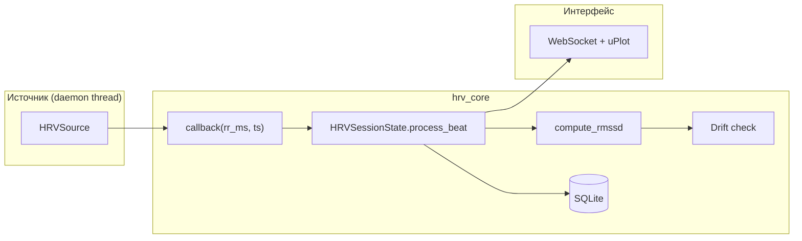

# Архитектура: HRV Awareness Monitor

Экспериментальная система мониторинга вариабельности сердечного ритма (HRV) в реальном времени: запись тегированных сессий, live-графики RMSSD, архив и сравнение практик.

> Операционные детали (веб-UI, BLE, mock, baseline): [hrv_mvp.md](hrv_mvp.md)

---

## Назначение

| Аспект | Описание |
|--------|----------|
| **Домен** | Biofeedback, wearables, экспериментальный дизайн |
| **Входной сигнал** | RR-интервалы (мс между ударами сердца) с Polar H10 или симулятора |
| **Ключевая метрика** | **RMSSD** — корень из среднего квадрата разностей соседних RR (окно 60 с) |
| **Real-time** | Графики RR и RMSSD, детекция **drift** (падение RMSSD относительно baseline) |
| **Накопление** | Тегированные сессии в SQLite, персональный baseline по часу суток, архив и прогресс |

**Важно:** drift и RMSSD — не диагноз и не «оценка осознанности». Это инструмент для сопоставления объективных кривых с субъективными метками в контролируемых экспериментах.

---

## Архитектурные слои

```
┌─────────────────────────────────────────────────────────────┐
│  UI                                                         │
│  hrv_web/ (FastAPI + SPA, uPlot, Web Audio)                 │
└────────────────────────────┬────────────────────────────────┘
                             │
┌────────────────────────────▼────────────────────────────────┐
│  hrv_core — ядро                                            │
│  pipeline (RMSSD, drift)  │  db │  summary │  sources       │
└────────────────────────────┬────────────────────────────────┘
                             │ callback(rr_ms, ts)
┌────────────────────────────▼────────────────────────────────┐
│  Источники данных (HRVSource)                               │
│  Mock  │  Polar BLE                                              │
└─────────────────────────────────────────────────────────────┘
```

**Принцип:** одно ядро (`hrv_core`), веб-интерфейс для записи и визуализации, локальное хранилище без облачных сервисов.

---

## Поток данных


```mermaid
flowchart LR
    subgraph Source["Источник (daemon thread)"]
        S[HRVSource]
    end

    subgraph Core["hrv_core"]
        CB["callback(rr_ms, ts)"]
        ST[HRVSessionState.process_beat]
        RM[compute_rmssd]
        DR[Drift check]
        DB[(SQLite)]
    end

    subgraph UI["Интерфейс"]
        WEB[WebSocket + uPlot]
    end

    S --> CB --> ST
    ST --> RM --> DR
    ST --> DB
    ST --> WEB
```

### Жизненный цикл сессии (arm — по каналу дыхания для BLE, по RR для mock)

Отсчёт длительности, ось live-графика, guided-фразы и release-протокол стартуют **не** в момент `POST /api/sessions`, а в момент **взведения** (arm). У взведения два пути, чтобы t0 совпадал с реальным стартом канала дыхания, а не подменялся первым RR:

- **mock** — акселерометра нет физически, взводим по первому RR, как раньше.
- **BLE** — взводим по **первой пачке акселерометра**. Если за `ACC_ARM_WAIT_SEC`
  (60 с) после первого RR канал не ответил (PMD умеет отказывать молча — см.
  § PMD-акселерометр), взводим запасным путём по этому же RR
  (`accel_missing=True` в сессии): RR неприкосновенен, ждать бесконечно нельзя.
  RR-удары **до** взведения не пишутся в БД и не идут в `HRVSessionState` —
  как будто их не было (иначе первый «настоящий» удар после взведения
  перестал бы быть первым для дельт RMSSD).

1. **Старт** (`SessionManager.start`): запись в `sessions` (`opt_acc_recording=1`
   всегда — см. § PMD-акселерометр), запуск источника, сторож `ARM_TIMEOUT_SEC`
   (300 с) на случай, если сессия так и не взведётся.
2. **Взведение** → `_arm(ts, accel_missing=...)`: `first_beat_at = ts`,
   `UPDATE sessions SET started = ts`, WS `{type:"armed", started_at, accel_missing}`,
   старт таймера авто-стопа (`duration_minutes`), если задан.
3. **Пока не взведено** (`RunningSession.device_state`, WS `{type:"device_state", state}`
   и поле в `GET /api/sessions/recording`): `"ble_repair"` (идёт пересопряжение) →
   `"waiting_accel"` (ждём поток PMD) → `"recording"` (взведено); mock —
   `"waiting_beat"` → `"recording"`.
4. **Клиент** (`app.js`): до arm — текст по `device_state` (`setLiveEmptyState`);
   по `armed` / `meta.first_beat_at` / первому `beat` — `armSession()` (T0,
   фразы, аудио); `accel_missing` в `armed`/`meta` — строка «канал не ответил»
   в панели записи (`acc_status`, без графика — живого дыхания при записи нет).
5. **Стоп** — summary, обновление персонального baseline по часу.

### Обработка одного удара

1. **Источник** (`hrv_core/sources.py`) в отдельном потоке вызывает `callback(rr_ms, ts)` и, если акселерометр поднялся, `acc_callback(batch_ts, samples, hz)`.
2. **`SessionManager`**: первый колбэк (RR для mock; первая пачка акселерометра
   или RR-запас для BLE, см. выше) вызывает `_arm`; после взведения каждый RR
   идёт в `RunningSession.on_beat`, каждая пачка — в `on_accel_batch`.
3. **`HRVSessionState.process_beat()`** (`hrv_core/pipeline.py`): скользящий буфер RR (60 с), RMSSD, drift; возвращает `BeatSample(ts, rr_ms, rmssd, drift_just_fired)` (первый удар может не дать sample, пока RMSSD = 0).
4. **Веб-слой** сохраняет точку в `hrv_points`, отправляет метрики по WebSocket, обновляет графики (uPlot); пачка акселерометра — в `hrv_accel_batches`, плюс лёгкий WS `{type:"accel_status", ts}` для строки состояния канала в панели записи.

---

## Компоненты

### `hrv_core/` — ядро

| Модуль | Роль |
|--------|------|
| `constants.py` | Пороги, таймауты, пути (`DB_PATH`, `DRIFT_THRESHOLD=0.80`, окно RMSSD 60 с) |
| `sources.py` | Абстракция `HRVSource`, реализации mock/BLE, фабрика `build_source()` |
| `pmd.py` | Протокол PMD Polar H10 (акселерометр): UUID, маска возможностей, разбор кадров, `PmdAccStream`; диагностика дыхания по Уэлчу для `pmd_check` (нарезка окон и брак по движению — из `breathing.py`) |
| `breathing.py` | Дыхание из акселерометра для БД/графиков: интерполяция 10 Гц → полосовой Баттерворт → фаза Гильберта (число циклов, мгновенная частота), окна качества с браком по движению — см. § PMD-акселерометр |
| `pmd_check.py` | `python -m hrv_core.pmd_check` — ручная диагностика PMD с надетым ремнём |
| `pipeline.py` | `compute_rmssd()`, `HRVSessionState`, детекция drift (опц. `notify-send`) |
| `db.py` | Схема SQLite, миграции, baseline по часу 0–23, удаление сессий, пачки акселерометра |
| `session_types.py` | Системные типы сессий (seed в БД при первом запуске): slug, label, mock-профиль, phrase_prefix |
| `tags.py` | Нормализация метки `tag` при старте сессии |
| `summary.py` | Session summary (JSON API) |
| `preprocessing.py` | Коррекция артефактов RR (Malik ~20% + интерполяция), detrend для FFT, границы viewport Poincaré |
| `analysis.py` | Post-session: Poincaré, Welch PSD, SDNN/RMSSD trends, coherence |
| `ble_scan.py` | BLE-сканирование Polar, проверка BlueZ/bleak (подключение) |
| `ble_repair.py` | Пересопряжение H10 без рук (bluetoothctl в pty) — условие работы PMD, см. § PMD-акселерометр |

### `hrv_web/` — веб-интерфейс

| Модуль | Роль |
|--------|------|
| `server.py` | FastAPI: REST + WebSocket, раздача статики |
| `session_manager.py` | `SessionManager` — одна активная сессия; arm по каналу дыхания (BLE) или по первому RR (mock); очередь WS |
| `static/app.js` | SPA: форма, WebSocket, архив, прогресс; `armSession` после взведения; `updateAccStatusTick` — строка состояния канала акселерометра в панели записи |
| `static/analysis_charts.js` | Отрисовка архивных графиков (RR, SDNN, Poincaré, FFT, дыхание, overlay) |
| `static/meditation_engine.js` | HRV-реактивные mp3-фразы (meditation → sit, relaxation → lay) |
| `static/timed_protocol_engine.js` | Последовательный протокол «Телесное расслабление» (`release`) по `release_schedule.json` |
| `static/hrv_audio_engine.js` | Web Audio: пульс, текстуры, трансовый pad |
| `static/session_mic_recorder.js` | Запись микрофона с arm: `prepare()` на POST, `startAtArm()` — новый stream и `MediaRecorder` в arm |
| `static/session_audio_player.js` | Архивный плеер: клик по RR → seek, playhead, Play/Pause |
| `static/index.html` | UI режимов «Дышащий Эмбиент» / «Трансовый Порог» |

### Точки входа

| Команда | Назначение |
|---------|------------|
| `python -m hrv_web` | Основной UI: http://127.0.0.1:8765/ |
| `python -m hrv_core.pmd_check [--mac AA:BB:..] [--seconds 30]` | Ручная проверка PMD-акселерометра с надетым ремнём (см. § PMD-акселерометр) |
| `python -m hrv_core.ble_repair [--mac AA:BB:..]` | Пересопряжение ремня вручную (диагностика); в обычной работе UI вызывает его сам, см. ниже |

---

## Абстракция источника данных

```python
class HRVSource(ABC):
    def start(self, callback, acc_callback=None): ...
    # callback(rr_ms: float, ts: float) — на каждый RR
    # acc_callback(batch_ts: float, samples: list[(x,y,z)], hz: float) — опционально,
    #   пачка отсчётов акселерометра (~1 с в mg); RR от него не зависит
    def stop(self): ...
```

| Реализация | Описание |
|------------|----------|
| `MockHRVSource` | AR(1)-симуляция; цикл focused→drift→recovering или профиль медитации (RSA); `acc_callback` игнорирует |
| `PolarH10Source` | BLE GATT 0x2A37, reconnect, watchdog по отсутствию RR; опционально поднимает PMD-акселерометр на **том же** `BleakClient`; если акселерометр запрошен, перед первым подключением один раз пересопрягает ремень (`_maybe_repair_bond`) |

Переключение: поле `source` в веб-форме (`mock`, `ble`).

### PMD-акселерометр (дыхание — механический канал)

Дыхание из ряда RR в этом проекте выводить запрещено (см. решения в
`research/`) — нужен независимый механический канал. Им служит акселерометр
Polar H10 через нестандартный сервис PMD (Polar Measurement Data), протокол —
`hrv_core/pmd.py`.

- **Одно BLE-соединение.** Второе соединение к H10 не открывается — акселерометр
  подписывается (`start_notify`) на том же `BleakClient`, что и HR-нотификации.
  `PmdAccStream.start()` включает control point, читает маску возможностей,
  затем пробует договориться о частоте по возрастанию `ACC_CANDIDATE_HZ =
  (25, 50, 100, 200)` — 25 Гц с запасом хватает на полосу дыхания (0.05–0.6 Гц)
  и в 8 раз снижает трафик/расход батареи против 200 Гц; резолюция 16 бит,
  диапазон 8g.
- **RR неприкосновенен.** Любая ошибка PMD (нет сопряжения — прошивка 5.0.0
  отвечает ATT 0x0e без bonding, маска без бита акселерометра, поток не пошёл,
  кадр не разобрался) — это `PmdError`/`PmdPairingRequiredError`, пойманная и
  залогированная в `PolarH10Source._start_pmd_accel`; RR-цикл (`_loop`) её не
  видит и продолжает работать как без акселерометра, включая reconnect.
- **Акселерометр обязателен для каждой BLE-записи** (решение заказчика,
  ADR-019 в `research/`) — опции `opt_acc_recording` в форме старта больше
  нет, `SessionManager` передаёт `acc_callback` в `source.start()` всегда.
  Колонка `sessions.opt_acc_recording` осталась только чтобы отличать старые
  записи (пишется 1 во все новые сессии); фактическое наличие канала в
  конкретной сессии — по строкам в `hrv_accel_batches`, не по этой колонке.
- **Взведение сессии — по каналу дыхания, не по RR** (для BLE; mock — по
  первому RR, см. § «Жизненный цикл сессии»). PMD документированно умеет
  отказывать молча (ниже), поэтому ожидание первой пачки ограничено
  `ACC_ARM_WAIT_SEC` (60 с в `hrv_web/session_manager.py`) — не дождались,
  взводимся по RR (`accel_missing=True`), RR остаётся неприкосновенным.
- **Хранилище — пачками, не построчно.** `RunningSession.on_accel_batch`
  копит отсчёты в `PmdAccStream` (~1 с на пачку) и пишет строку в
  `hrv_accel_batches` через `db.insert_accel_batch`; ошибка записи логируется
  и глотается, RR не страдает. Чтение обратно — `db.load_accel_samples(conn,
  session_id) → [(ts, x, y, z), …]`.
- **Метрика дыхания — `hrv_core/breathing.py`**, post-session (см. § «Post-session
  анализ»): резонанс с фазой Гильберта, не пики и не спектр (аргумент —
  ниже). Живого графика во время записи нет (решено отдельно) — только строка
  состояния канала в панели записи (идут ли пачки, когда была последняя),
  см. `RunningSession.last_accel_at` и WS `{type:"accel_status"}`.
- **Проверка человеком:** `python -m hrv_core.pmd_check` — связь, сопряжение,
  маска возможностей, 30 с потока, фактическая частота, разброс по осям,
  диагностика дыхания по Уэлчу (только для этой команды — ниже почему это не
  годится для итоговой метрики). При ATT 0x0e печатает то же сообщение
  про `bluetoothctl pair`, что и лог боевой сессии.

**Проверено на живом устройстве** (прошивка 5.0.0): договор о настройках,
старт, разбор кадров. Кадр данных — 226 байт: тип, метка времени (8 б), тип
кадра, затем 36 отсчётов по три int16 LE. Уведомления приходят ~раз в 1.4 с
при 25 Гц.

**Условие, без которого поток не идёт: одно соединение на bond.** Данные PMD
приходят, пока держится то BLE-соединение, в котором акселерометр заработал
впервые после сопряжения. Внутри этого соединения измерение можно
останавливать и запускать заново сколько угодно. Но первый же разрыв
соединения, после которого PMD хоть раз отдавал кадры, гасит акселерометр для
этого bond'а окончательно — и молча: шифрование поднимается, control point
отвечает, старт возвращает SUCCESS, повторный старт — ALREADY_IN_STATE (то
есть измерение внутри датчика идёт), а уведомлений на характеристике данных
нет ни одного. Лечится только новым сопряжением.

Установлено сравнением HCI-трасс (`btmon`) рабочего и нерабочего прогонов: на
уровне ATT они совпадают побайтово — та же запись CCC `0100`, та же команда
старта, тот же ответ, — различается только наличие Handle Value Notification.
Значит молчит сам датчик, а не хост.

Проверено и **не** помогает: обесточивание датчика (снять модуль с ремня),
`systemctl restart bluetooth`, удаление карты сервисов и GATT-кэша BlueZ,
переподписка на характеристику данных при идущем измерении, подъём соединения
сторонним клиентом, отказ от команды стопа перед разрывом. Не важно и то, кто
поднял соединение: после свежего сопряжения можно уронить линк сопряжения, не
использовав PMD, подключиться заново — и поток пойдёт.

Отсюда рабочий порядок: пересопряжение непосредственно перед каждой записью с
акселерометром — одно пересопряжение даёт ровно одну запись. Раньше это
приходилось вызывать вручную (`./start.sh --accel`) один раз при запуске UI, и
вторая запись за вечер оставалась без акселерометра. Теперь `PolarH10Source`
делает это сам: если сессия стартует с `opt_acc_recording=True`, в фоновом
потоке BLE-источника (`_maybe_repair_bond`, вызывается из `_loop` до первого
подключения) выполняется `hrv_core.ble_repair.repair()` — один раз на запись,
не блокируя event loop и не мешая RR при любой ошибке (датчик не найден,
`bluetoothctl` недоступен, таймаут — логируется, запись продолжается без
акселерометра). `python -m hrv_core.ble_repair` остаётся как ручной инструмент
диагностики.
`PmdAccStream` и `pmd_check` печатают сырые данные на каждом шаге (`on_event`),
чтобы расхождение разбора с реальностью было видно по одному прогону.

---

## Baseline и drift

| Термин | Когда используется |
|--------|-------------------|
| **Session baseline** | ≥ 30 точек RMSSD в сессии → среднее по последним до 60 значений |
| **Persistent baseline** | < 30 точек → среднее RMSSD для часа старта из таблицы `baseline` |
| **Drift** | `current_rmssd < baseline × 0.80`, не чаще 1 раза в 120 с |

Persistent baseline накапливается между сессиями инкрементально (cap 500 сэмплов на час).

---

## Модель данных (SQLite)

Файл: `hrv_data.sqlite` (создаётся автоматически).

```sql
sessions        (id, tag, source, session_name, participant, started, ended,
                 drift_events, opt_guided_phrases, opt_audio_biofeedback,
                 opt_mic_recording, opt_acc_recording, has_audio)
hrv_points      (id, session_id, ts, rr_ms, rmssd)
hrv_accel_batches (id, session_id, ts, hz, n_samples, data)  -- data: blob int16 x,y,z…
baseline        (hour, rmssd_mean, n_samples, updated_at)   -- hour 0–23
session_types   (slug, label, phrase_prefix, mock_profile, chart_profile, is_custom)
meditation_phrase_log (session_id, phrase_file, played_at, rn_before, rmssd_before, …)
session_explanations (session_id PK, body, author, created_at, updated_at)

ix_hrv_points_session_ts        ON hrv_points(session_id, ts)
ix_hrv_accel_batches_session_ts ON hrv_accel_batches(session_id, ts)
ix_phrase_log_session           ON meditation_phrase_log(session_id)
```

Индексы создаёт `init_db` (`CREATE INDEX IF NOT EXISTS`) — отдельной миграции не
нужно. Без них любой запрос точек одной сессии — полный скан всей таблицы:
на 230 тыс. точек это ~0.9 с на каждое открытие соединения (там гоняется
`_repair_session_timelines`) и ~1.2 с на список сессий.

`hrv_accel_batches`: одна строка ≈ 1 секунда потока (не по отсчёту — иначе 25 Гц ×
3 оси × 40 мин раздувают таблицу до ~60 тыс. строк за сессию). `ts` — та же
шкала эпохи, что `hrv_points.ts` (для общей оси `ts - sessions.started`). `data`
— `struct.pack("<Nh", …)`, N = 3 × n_samples, оси подряд (x0,y0,z0,x1,…);
пакует/распаковывает `hrv_core.db.pack_accel_samples`/`unpack_accel_samples`.
Чтение обратно — `hrv_core.db.load_accel_samples(conn, session_id)`.

`sessions.opt_acc_recording`: с Части A (акселерометр обязателен) пишется `1`
во все новые сессии — колонка только отличает старые записи (`0`), где канала
не было вовсе. Отличить старую сессию от новой, где PMD просто не ответил
(`accel_missing`), эта колонка не может — для этого смотреть строки в
`hrv_accel_batches`.

`session_explanations`: разбор сессии — связный текст (markdown), который Claude
пишет по номеру сессии, чтобы графики читались словами. Отдельная таблица, а не
поле в `sessions`, намеренно: `session_name` — заметки испытуемого, и когда туда
однажды положили разбор от Claude (сессии 91–93), авторство текста восстановить
уже было нечем. Одна запись на сессию (перезапись меняет `body`/`updated_at`,
`created_at` сохраняется), удаляется вместе с сессией и при очистке истории.

**Файлы:** `session_audio/{session_id}.webm` — записи микрофона рядом с БД.

`sessions.started` при INSERT — момент создания; после arm переписывается временем первого RR (канонический t₀ длительности и оси `ts - started`).

### Тегирование

Два независимых механизма — подробнее в [hrv_mvp.md § Тегирование](hrv_mvp.md#тегирование-сессий):

| | Поле БД | Как задать | Фильтр в UI |
|---|---------|------------|-------------|
| **Тип активности** | `sessions.tag` (slug) | Список «Тип активности» до старта | «Тип активности» |
| **Теги заметок** | `#…` внутри `sessions.session_name` | Поле «Заметка» / модал после «Стоп» | «Тег заметки» |

**Типы активности (slug в `sessions.tag`):** системные — `relaxation`, `meditation`, `release`, `test`, `yoga`, `sleep`, `work`, `mental_training`; плюс пользовательские в `session_types` (`is_custom=1`). Тип `release` — timed-протокол через [`timed_protocol_engine.js`](hrv_web/static/timed_protocol_engine.js) и `phrases/release/`.

**Теги заметок:** формат `#слово` в тексте заметки. Парсинг — [`hrv_core/note_tags.py`](hrv_core/note_tags.py). API: `GET /api/note-tags`; фильтр — один или несколько `note_tag=…` (OR: сессия содержит любой из тегов).

- **Seed:** при старте `init_db()` таблица `session_types` синхронизируется с [`hrv_core/session_types.py`](hrv_core/session_types.py); устаревшие встроенные slug-и удаляются.
- **Runtime (веб):** списки в форме и фильтрах — `GET /api/session-types`; новый тип — «Новая активность…» → `POST /api/session-types`.

---

## Веб-API (кратко)

| Endpoint | Метод | Описание |
|----------|-------|----------|
| `/` | GET | SPA |
| `/api/health` | GET | Статус сервера и путь к БД |
| `/api/session-types` | GET | Список типов активности (системные + пользовательские) |
| `/api/session-types` | POST | Создать пользовательский тип (`slug`, `label`) |
| `/api/session-types/{slug}` | DELETE | Удалить пользовательский тип (системные — 403) |
| `/api/note-tags` | GET | Уникальные теги из заметок (`#утро` → `утро`) |
| `/api/sessions` | POST/GET | Старт (акселерометр запрашивается всегда для BLE) / список сессий (фильтры: participant, tag, note_tag, период) |
| `/api/sessions/{id}` | PATCH | Заметки после завершения (`session_name`) |
| `/api/sessions/{id}/stop` | POST | Остановка + summary |
| `/api/sessions/recording` | GET | Статус активной сессии: `device_state`, `accel_missing`, `last_accel_at` (для восстановления UI после перезагрузки страницы) |
| `/api/sessions/{id}/stream` | WebSocket | Live: `meta` (`first_beat_at`, `device_state`, `accel_missing`), `device_state`, `armed` (`accel_missing`), `beat`, `accel_status` (`ts` последней пачки), `ended` |
| `/api/sessions/{id}` | GET/DELETE | Summary завершённой сессии / удаление (+ файл аудио) |
| `/api/sessions/{id}/audio` | PUT | Сохранить запись микрофона (raw body webm/ogg, после stop) |
| `/api/sessions/{id}/audio` | GET | Отдать файл записи (`audio/webm`) |
| `/api/sessions/{id}/explanation` | GET | Разбор сессии (`{"explanation": {...}\|null}`) |
| `/api/sessions/{id}/explanation` | PUT | Записать разбор. Тело — JSON `{body, author}` **или** сырой markdown (тогда автор из `?author=`); лимит 20 000 символов |
| `/api/sessions/{id}/explanation` | DELETE | Удалить разбор |
| `/api/sessions/{id}/points` | GET | Точки (с downsampling) |
| `/api/sessions/{id}/analysis` | GET | Post-session анализ (Poincaré, спектр, SDNN, RMSSD); всегда по полному ряду, `max_points` режет только тахограмму RR |
| `/api/sessions/{id}/breathing` | GET | Post-session дыхание из акселерометра (см. § «Дыхание из акселерометра»); `max_points` |
| `/api/progress` | GET | Наложение RMSSD-кривых завершённых сессий |
| `/api/progress/analysis` | GET | Overlay Poincaré / спектр / SDNN; фильтры сессий; всегда по полному ряду, `max_points_per_session` режет только тахограмму RR |
| `/api/history` | DELETE | Очистка всей истории |
| `/api/meditation/phrase-sets` | GET | Список наборов фраз (`?prefix=sit\|lay`) |
| `/api/meditation/phrase-manifest` | GET | Список mp3 в `static/phrases/{prefix}/{set}/` |
| `/api/meditation/phrase-log` | POST/PATCH | Лог воспроизведения guided-фраз |
| `/api/meditation/phrase-stats` | GET | Статистика фраз по `session_id` |

Разбор приходит и внутри `GET /api/sessions/{id}` (поле `explanation`), а в
списке сессий есть флаг `has_explanation` — UI не делает лишнего запроса.
Записать разбор из терминала:

```bash
curl -X PUT --data-binary @разбор.md -H 'Content-Type: text/markdown' \
  'http://127.0.0.1:8765/api/sessions/219/explanation?author=claude'
```

Одновременно допускается **только одна активная сессия** (409 Conflict при повторном старте).

Подробная интерпретация графиков и опций UI: [explain.md](explain.md).

---

## Post-session анализ (графики)

После **Стоп** сессии вкладки **Архив** и **Прогресс** запрашивают анализ у сервера. Live-графики на вкладке «Запись» считаются в браузере из WebSocket; post-session — в [`hrv_core/analysis.py`](hrv_core/analysis.py).

**Ось времени (t₀):** `raw_rr_x` — секунды от t₀; t₀ = timestamp первой сохранённой RR-точки (≈ arm). Sync с аудио: `audio.currentTime = x` от arm. При старте `init_db()` сессии с `started` >1 с раньше первой точки (POST до Polar) **авто-чинятся** в БД.

**Аудио:** `audio_delay_sec` — локальная задержка arm→recorder (<2 с); в summary как `audio_offset_sec`. Плеер: `session_t = audio.currentTime − offset`. Playhead: `uPlot.valToPos(t, "x", true)` уже в canvas-координатах — без повторного `bbox.left`. Графики архива — на corrected RR; сырой ряд остаётся в БД (`hrv_points` / `raw_rr`).

### Поток данных

```
hrv_points (ts, rr_ms, rmssd)  — сырые RR в БД, читаются ЦЕЛИКОМ (без децимации)
  → correct_rr_artifacts() → session_analysis() / progress_session_analysis()
  → JSON (analysis_rr_*, poincare, spectrum, …) → analysis_charts.js (uPlot)
```

**Децимация — только на выходе, никогда на входе.** `session_analysis()` считает
всегда по полному ряду сессии: RMSSD/SD1/тренды — это разности СОСЕДНИХ ударов, и
любое прореживание ряда до расчёта делает соседями удары, которые ими не были —
метрики расходятся с реальными (на записи в несколько часов — почти вдвое). Каждый
график режет свой выход сам: `poincare_pairs(max_points=2500)`,
`moving_sdnn`/`rmssd_trend` (`trend_max=500`, децимация индексов после расчёта),
`compute_spectrum` (размер выхода зависит от длины записи, не от числа сырых точек —
ресемплинг на равномерную сетку `DEFAULT_FS`). `raw_rr`/`analysis_rr` — единственные
поля, которые до этой правки отдавались целиком; `raw_rr_timeline(max_points=…)`
режет их так же, децимируя индексы, а не значения перед расчётом.
`GET /api/sessions/{id}/analysis?max_points=` передаётся в `session_analysis(...,
raw_rr_max=max_points)` — управляет только длиной этих двух тахограмм.

Тот же принцип и в `progress_session_analysis()` (`GET /api/progress/analysis`,
overlay нескольких сессий): `max_points_per_session` передаётся как `raw_rr_max`,
входной ряд каждой сессии в `hrv_web.server.progress_analysis` больше не режется
`_decimate_rows` перед расчётом. На overlay это заметнее по стоимости, чем в разборе
одной сессии — там пересчитываются сразу все длинные сессии окна (по БД их три:
225, 91, 96) — но остаётся в пределах ~1 секунды на 40 сессий (было ~0.97 с,
стало ~1.06 с).

`_decimate_rows` остался как есть (децимация на входе) в `/api/progress` и
`GET /api/sessions/{id}/points` — эти два эндпойнта отдают сырые точки как есть
({x, rr} / {ts, rr_ms, rmssd}), без метрик на разностях соседних ударов; резать
вход там нечем не испортить.

### Графики и расчёт

| График | Модуль | Алгоритм |
|--------|--------|----------|
| **RR** | `analysis_rr_*` | Corrected tachogram (Malik); ось X = секунды от t₀ |
| **Poincaré** | `poincare_pairs` | Пары (RRₙ, RRₙ₊₁) по corrected, SD1/SD2; decimate до 2500; viewport p5–p95 |
| **Спектр (FFT)** | `compute_spectrum` | Corrected → интерполяция 4 Гц → detrend → Welch PSD; пик в 0.04–0.15 Гц |
| **Coherence** | `coherence_score` | Доля мощности в 0.08–0.12 Гц от суммы 0–0.5 Гц (%) |
| **SDNN trend** | `moving_sdnn` | std(corrected RR) в окне 60 с; первые 20 с не рисуются |
| **RMSSD trend** | `rmssd_trend` | sqrt(mean(diff²)) по corrected RR в окне 60 с (`RMSSD_WINDOW_SEC`); первые 20 с не рисуются |
| **Дыхание** (если есть акселерометр) | `hrv_core/breathing.py` | См. § «Дыхание из акселерометра» ниже |

`rmssd_trend` раньше рисовался по «живой» колонке `hrv_points.rmssd` — посчитанной на лету
по нефильтрованному буферу (`hrv_core/pipeline.compute_rmssd`), а не по corrected RR, как
остальные графики. Единичный выброс (например RR при надевании ремня) до коррекции давал
пик, который сплющивал всю кривую тренда. Теперь `rmssd_trend` считается тем же способом,
что и `moving_sdnn` — скользящее окно по времени над `analysis_rr` — и живёт в
`hrv_core/analysis.py` через общий приватный `_moving_trend`. **Live-график во время
записи (`progress_session_analysis` не используется там; экран активной сессии) на эту
правку не завязан** — он продолжает питаться живой колонкой `hrv_points.rmssd`.

`_moving_trend` считает оба тренда за один проход без O(n²): левая граница окна —
`np.searchsorted` по отсортированному `ts` (окно монотонно), статистика — префиксными
суммами (SDNN — сумма значений и сумма квадратов; RMSSD — префиксная сумма квадратов
последовательных разностей). Предыдущая версия строила булеву маску по всему `ts` на
каждой точке — на ночной записи (десятки тысяч ударов) это секунды на один тренд.

**Разрывы записи в тренде** считаются по полному ряду сессии (см. «децимация — только
на выходе» выше), не по прореженному для отрисовки RR. Критерий (`TREND_BREAK_GAP_SEC=4.0`
в `hrv_core/constants.py`):
пауза между соседними `ts` дольше 4 с внутри 60-секундного окна — удары физически не были
получены, окно недостоверно. Такая точка тренда (SDNN и RMSSD — природа общая) уходит в
ответе как `null`, сам разрыв — в список `gaps` (`{t_start, t_end, rejected: true}`,
секунды от t₀), которым `analysis_charts.js` затеняет график (`drawRejectedWindows` — тот же
приём и код, что и для забракованных окон дыхания). Обрезка первых `SDNN_INITIAL_CROP_SEC`
секунд по-прежнему просто не эмитится (не путать с `null`-разрывом).
Осознанно НЕ используется как критерий доля исправленных ударов в окне — она стирает
и обычную кривую в местах реального содержания (см. журнал/PR: 3.8% кривой при пороге ≥2%,
медиана тренда на этих точках была выше общей).

**Полоска качества** (`quality_strip`) — доля исправленных ударов (`correct_rr_artifacts`)
по минутным окнам, рисуется тонкой полосой под графиком тренда; в отличие от `gaps` ничего
не скрывает, только подсвечивает плотность коррекции. **`break_summary`**
(`{broken_minutes, total_minutes}`) — то же деление на минуты, посчитано в сводку сессии
(«Разрывы записи: N из M мин» в `arch_summary_grid`).

**Шкала Y тренда:** переключатель линейная/логарифмическая на графиках SDNN и RMSSD
(`opts.scale` в `makeSdnnPlot`/`makeRmssdPlot`), по умолчанию линейная, выбор не хранится
между сессиями архива. Лог-режим переводит нули/отрицательные значения в `null` отдельно от
разрывов (`distr:1` не принимает такие точки).

Константы: `ARTIFACT_REL_THRESHOLD=0.20`, `ARTIFACT_MEDIAN_WINDOW=5`, `RR_PHYSIO_MIN_MS=300`, `RR_PHYSIO_MAX_MS=2000`, `MIN_SPECTRAL_SEC=60`, `SDNN_INITIAL_CROP_SEC=20`, `TREND_BREAK_GAP_SEC=4.0`.

### Коррекция артефактов (всегда)

Все post-session графики и метрики строятся на corrected RR. Сырые значения пишутся в БД без изменений.

Алгоритм ([`correct_rr_artifacts()`](hrv_core/preprocessing.py)): **Malik ~20% к локальной медиане** — интервал-артефакт, если вне **300–2000 ms** или \(|RR_i - \mathrm{med}_i| / \mathrm{med}_i > 0.20\), где \(\mathrm{med}_i\) — скользящая медиана по окну `ARTIFACT_MEDIAN_WINDOW=5`; затем линейная интерполяция по индексу. Поле ответа `outliers: {applied, removed}`.

Опора именно медианная, а не «последний принятый интервал»: последняя работает как храповик — при медленном дрейфе ЧСС первый же отказ замораживает опору, и остаток записи бракуется целиком (на реальных сессиях доходило до 100% ударов, после интерполяции ряд превращался в прямую и RMSSD давал 0).

### Ответ `/api/sessions/{id}/analysis`

Ключевые поля: `raw_rr`, `raw_rr_x`, `analysis_rr`, `analysis_rr_x`, `poincare`, `spectrum`, `sdnn_trend`, `rmssd_trend`, `gaps`, `quality_strip`, `break_summary`, `mean_rr`, `coherence_score`, `outliers`.

### Дыхание из акселерометра (`hrv_core/breathing.py`, `GET /api/sessions/{id}/breathing`)

Метод сверен вручную с нажатиями человека на каждый вдох на живых прогонах
(0.3–1.3% расхождения по числу циклов, детали — в `research/`, сюда только
результат):

1. Отсчёты (x, y, z, мг, реально ~25.5 Гц) интерполируются на равномерную
   сетку **10 Гц**.
2. Полосовой Баттерворт 2-го порядка **0.10–0.45 Гц** (6–27 цикл/мин),
   нулевая фаза (`filtfilt`), после `detrend`.
3. **Несущая ось выбирается по данным** — та из трёх, у которой p75 модуля
   отфильтрованного сигнала наибольший (не назначается заранее: выбирает то,
   как ремень сидит на груди).
4. **Число циклов = разность фаз Гильберта / 2π**, не подсчёт пиков: подъём и
   спад грудной клетки несимметричны, детектор пиков дробит вдох надвое и
   завышает счёт на ~13%.
5. **Частота для графиков — производная фазы** (цикл/мин, сглажена окном
   ~15 с), **не argmax спектра**: на слабом сигнале argmax прыгает на вторую
   гармонику (живой прогон дал 30 и 35 цикл/мин отдельными окнами при
   настоящих 16.6). Оценка по Уэлчу осталась только диагностикой в
   `pmd_check` (см. § PMD-акселерометр).
6. **Качество** — окна 60 с / шаг 30 с: амплитуда (p75 модуля несущей) и брак
   по движению, если амплитуда окна больше `MOTION_REJECT_FACTOR` (×3) медианы
   амплитуд по прогону. Нарезка на окна и правило браковки —
   `iter_windows`/`motion_reject_windows`, общие с диагностикой в `pmd.py`.

Эндпойнт (`GET /api/sessions/{id}/breathing`, только post-session, ось времени
та же, что у `/analysis` — секунды от `sessions.started`) отдаёт: `has_accel`
(явно `false`, если строк в `hrv_accel_batches` нет — не пустые массивы,
которые фронт нарисовал бы как ноль), `insufficient_data`, волну (`t`,
`wave_mg`, прорежённые `decimate_for_transport` до ≤4 Гц/точку и `max_points`),
ряд `rate_cpm`, `windows` (`t_start`, `t_end`, `amp_mg`, `rejected`) и `summary`
(`cpm_median`, `good_fraction`, `amp_median_mg`, `axis`).

Графики (`analysis_charts.js`: `makeBreathingWavePlot`/`makeBreathingRatePlot`/
`makeBreathingRateRmssdPlot`, в стиле `makeRawRrPlot`/`makeRmssdPlot`) —
волна с затенением забракованных окон (`drawRejectedWindows`, по образцу
`drawTrimBands`), частота дыхания, и частота дыхания вместе с трендом RMSSD на
двух шкалах Y (RMSSD интерполируется на сетку дыхания — `interpolateSeries`).
Блок (`#arch_breathing_block`) скрыт целиком, если `has_accel=false` —
так выглядит большинство сессий до Части A (акселерометр стал обязательным).
Живого графика во время записи нет (решено отдельно) — есть только строка
состояния канала, см. § PMD-акселерометр.

### Guided meditation и release-протокол

Фразы: `hrv_web/static/phrases/{prefix}/{set}/` (`prefix`: `sit` / `lay` / `release` из `session_types.phrase_prefix`).

| Режим | Движок | Старт |
|-------|--------|-------|
| Guided (meditation / relaxation, …) | [`meditation_engine.js`](hrv_web/static/meditation_engine.js) | После `armed` (первый RR) |
| `release` (телесное расслабление) | [`timed_protocol_engine.js`](hrv_web/static/timed_protocol_engine.js) + `release_schedule.json` | После `armed` |

---

## Веб-аудио: где генерируется звук

Генеративный звук синтезируется **только в браузере** (Web Audio API). Сервер аудио не передаёт: по WebSocket приходят метрики (`beat`), клиент воспроизводит звук локально.

**Файлы:** [`hrv_web/static/hrv_audio_engine.js`](hrv_web/static/hrv_audio_engine.js) (синтез), [`hrv_web/static/app.js`](hrv_web/static/app.js) (маршрутизация).

### Цепочка вызова

```
WebSocket { type: "beat" }
  → app.js: onWsMessage()
  → processAudioFrame(msg, i)
  → audioEngine.processFrame(frame)   // фон + трансовый pad
  → audioEngine.triggerBeat(rr_ms)    // щелчок на каждый удар
```

Кадр `beat` содержит: `r` (RR), `m` (RMSSD), `sr` (smoothed_rr), `rn` (rmssd_normalized), `bl` (session baseline), `drift`.

### 1. Звук на каждый пульс

| | |
|---|---|
| **Метод** | `HrvAudioEngine.triggerBeat(rrMs)` |
| **Когда** | На **каждый** RR из WebSocket, в **обоих** режимах |
| **Как** | Два одноразовых осциллятора (sine + triangle), AD-огибающая ~0.22 с |
| **Частота** | `_rrToPitch()` — пентатоника из `config.beat.pentatonic` по RR |
| **Выход** | `heartBeatGain` → `masterGain` → динамики |

Параметры: `config.beat.duration`, `gainPeak`, `pentatonic`.

### 2. Монотонный (фоновый) звук

| | |
|---|---|
| **Запуск** | `HrvAudioEngine.start()` → `_createTexture()` |
| **Текстуры** | `space_pad` (4 sawtooth), `sea_wave` (loop-шум + LFO), `tibetan_bowl` (5 sine + LFO) |
| **Когда играет** | Постоянно после «▶ Запустить звук», пока сессия активна |

**Режим «Дышащий Эмбиент»** (`smooth_rr`): громкость фона не меняется, меняется **cutoff lowpass** по `smoothed_rr` — `_setTextureCutoff()` в `processFrame()`.

**Режим «Трансовый Порог»** (`rmssd_trigger`): та же текстура играет тихо (`rmssdTrigger.textureGain`) через `rmssdMixGain`.

### 3. Звук на резкую смену состояния (только «Трансовый Порог»)

| | |
|---|---|
| **Режим** | `rmssd_trigger` |
| **Осцилляторы** | 4 sine на `padFreqs` — создаются в `start()`, крутятся всегда |
| **Триггер** | `processFrame()` при изменении `rmssd_normalized` |
| **Громкость** | `_rmssdToPadGain(rn)` → `padGain.setTargetAtTime(gain, t0, padSmoothSec)` |

Пороги (`config.rmssdTrigger`):

| Параметр | Значение | Смысл |
|----------|----------|--------|
| `threshold` | 1.0 | ниже — pad выключен |
| `rampStart` | 2.5 | начало нарастания |
| `rampEnd` | 3.5 | полная громкость `padGainMax` |
| `padSmoothSec` | 0.08 | скорость нарастания/затухания pad |

«Скачок» = рост `rn` выше `rampStart`; затухание — когда `rn` падает (тот же `padSmoothSec`).

### Режимы и микшер

```
masterGain
├── heartBeatGain          ← triggerBeat (всегда)
├── smoothMixGain          ← текстура в режиме smooth_rr
└── rmssdMixGain           ← текстура (тихо) + padGain (транс)
```

Переключение режимов: радиокнопки `audio_mode` в форме → `setMode()` кроссфейдом `rampSec`.

---

## Потоки и синхронизация

| Поток | Роль |
|-------|------|
| Источник (mock / asyncio BLE) | Producer: вызывает callback на каждый RR |
| Main / FastAPI | Consumer: WebSocket, SQLite, uPlot в браузере |
| `notify-send` | Опционально в `HRVSessionState` (в веб-сессии отключён: `desktop_notify=False`) |

Обмен данными: `collections.deque` (thread-safe), `queue.Queue` для WebSocket. SQLite: `check_same_thread=False`.

---

## Стек

Python 3.12 · numpy · scipy · bleak (BLE) · FastAPI · uvicorn · SQLite · uPlot (CDN)

---

## Паттерны проектирования

- **Strategy + Factory** — `HRVSource` + `build_source(kind)`.
- **Shared core, web UI** — один pipeline, веб для записи и графиков.
- **Single active session** — `SessionManager`.
- **Arm on first RR** — таймер и UI-движки стартуют с первого удара, не с кнопки «Старт».
- **Incremental personal baseline** — per-hour RMSSD между сессиями.
- **Graceful hardware handling** — reconnect, watchdog, подсказки про «занятый» H10.

---

## Структура репозитория

```
consciousness/
├── .cursor/
│   ├── rules/project-context.mdc   # always-on: читать/синхронизировать ARCHITECTURE
│   └── skills/project-context/     # bootstrap + refresh after commit
├── hrv_core/           # Ядро: источники, pipeline, БД, analysis, preprocessing
├── tests/              # unittest (pipeline, tags, analysis stable zone, …)
├── hrv_web/            # FastAPI + статика (app.js, analysis_charts.js, …)
├── requirements.txt
├── hrv_data.sqlite     # БД (runtime)
├── explain.md          # Графики: расчёт, опции, интерпретация
├── ARCHITECTURE.md     # Этот документ (канон контекста для агента)
└── hrv_mvp.md          # Детальная спецификация MVP
```

---

## Аудио-биофидбек (веб)

Биофидбек реализован в браузере: вкладка «Биофидбек», [`hrv_audio_engine.js`](hrv_web/static/hrv_audio_engine.js) (Web Audio). Сервер передаёт только метрики RR/RMSSD по WebSocket.

